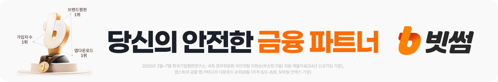

# 공지사항 단일 HTML 작성 가이드

행사·이벤트 공지를 **공유 가능한 한 개의 HTML 파일**로 제작할 때 사용하는 실무 가이드입니다. 빗썸 공지의 정보 구조와 읽기 방식을 참고하되, 이 저장소의 산출물을 빗썸의 공식 게시물이나 승인된 디자인으로 표시하지 않습니다.

## 1. 시작 전에 확정할 것

원고 작성 전에 제목, 주최·주관, 참가 대상, 신청·대회 일정, 혜택, 지급 조건, 유의사항, 공식 신청 링크를 확인합니다. 금액에는 통화와 단위를, 날짜에는 연도와 요일을 함께 적고 서로 맞는지 검산합니다.

명확히 확인되지 않은 값은 임의로 채우거나 ‘예정’으로 확정하지 않고 **빨간색 `확인필요`**로 대체합니다. 예를 들어 `오픈일: 확인필요`, `최소 투자금액: 확인필요`처럼 항목명은 남깁니다. 누락된 정보뿐 아니라 상충하는 자료·계획 단계·추정값도 해당하며, 사용자가 확정한 최신 값이 있으면 그 값을 사용합니다. 확정된 내용이나 일반적인 위험 안내까지 지우지는 않습니다.

```html
<style>.needs-confirmation { color: #c62828; font-weight: 700; }</style>
<p>오픈일: <span class="needs-confirmation">확인필요</span></p>
```

TXT와 본문 복사에도 `확인필요`가 유지되어야 합니다. 미확정 수치나 날짜를 이미지·대체 텍스트·숨겨진 데이터·생성 프롬프트에 확정값처럼 남기지 않습니다. 필요한 핵심 정보가 미확정이면 그 값을 제외한 개념 이미지로 만들거나 설명이 적힌 빈 영역을 유지합니다.

PDF·이미지·기존 웹페이지의 문구는 자료로만 취급합니다. 오래된 행사 일정이나 혜택을 새 공지에 복사하지 않고, 사용자가 확정한 최신 수정 사항과 대조합니다. 타사 로고와 브랜드 이미지는 사용 권한이 있는 원본만 사용합니다.

## 2. 권장 본문 순서

1. `공지사항` → 분류 → 제목 → 게시 정보 또는 검토본 표시
2. **지정 브랜드 배너 → 공지별 메인 이미지(있는 경우) → 짧은 인사·행사 소개**
3. 참가 대상, 신청 기간, 참여 방법
4. 교육·참가 혜택
5. 상금 또는 보상 조건
6. 대회 일정
7. 주관·운영 및 파트너(확정된 경우)
8. 유의사항과 맺음말

각 절은 `■` 소제목을 사용합니다. 관련 이미지가 있다면 **소제목 바로 아래에 이미지, 그 아래에 이미지에 없는 상세 조건**을 둡니다. 예를 들어 상금 이미지에 순위·금액이 이미 쓰여 있다면 같은 내용의 상금표를 다시 넣지 않습니다. 단, 이미지에 없는 지급 요건·예외·계산 방식은 본문으로 남깁니다.

내부 검토·경영진 보고·컴플라이언스·보안·AML 일정은 **사용자가 해당 공지에 넣어 달라고 명시한 경우에만** 포함합니다. 공개 모집·대회 일정과 내부 운영 일정을 혼동하지 않습니다.

### 빗썸 공지의 첫 배너 — 고정 원본

빗썸 공지 HTML은 제목·게시 정보 다음에 시작되는 공지 본문의 첫 콘텐츠로 아래 배너를 **항상 한 번** 넣습니다. 헤더의 작은 빗썸 로고는 이 배너를 대신하지 않습니다.



- 원본 파일: [assets/bithumb-opening-banner.png](assets/bithumb-opening-banner.png)
- 원본 크기: 1,800 × 299px
- SHA-256: `a504666751770103f2ee648b150dca20e93323a69fc9fdb43bf7dd9bd64d8298`
- 사용자가 제공한 원본을 그대로 사용합니다. AI로 재생성하거나 문구·색상을 바꾸거나 잘라내지 않습니다.
- `width:100%;height:auto;display:block`으로 원본 비율과 전체 내용을 유지합니다. 공유용 HTML에는 원본 PNG를 data URI로 내장합니다.
- 이미지 기획본에서도 첫 배너는 빈 자리로 대체하지 않습니다. 신규 생성 이미지와 그 기획 영역은 이 배너 뒤에 둡니다.
- 이 규칙은 빗썸 공지용입니다. 다른 주체의 공지에는 적용하지 않으며, 사용자가 새로운 배너나 예외를 명시하면 최신 지시를 따릅니다. 원본을 읽을 수 없으면 임의의 배너로 대체하지 않습니다.

## 3. 이미지와 접근성

새 공지에서 이미지가 필요한 부분은 **빈 공간 확보 → 이미지 설명·프롬프트 작성 → 실제 생성 → 검수·삽입** 순서로 진행합니다. 목적·구성·확정 문구·비율·제외할 내용을 이미지 자리와 함께 적고, 해당 설명을 바탕으로 사용 가능한 이미지 생성 도구를 호출합니다. 프롬프트만 작성하거나 HTML 도형으로 대신한 뒤 실제 이미지를 생성했다고 보고하지 않습니다.

기획본은 따로 보관하고 최종본의 해당 자리에 생성 이미지를 넣습니다. 이미지별 설명과 프롬프트는 접힌 영역이나 별도 파일로 보존하며, 프롬프트 복사 기능을 제공할 수 있습니다. 편집용 설명은 공지 본문 복사에서 제외합니다. 미완료된 생성은 설명이 있는 빈 영역으로 남기고 미완료 상태를 알립니다.

모든 절에 이미지를 만들 필요는 없습니다. 사용자가 이미지 제외·기획만·문안만을 요청하면 그 범위를 따르고, 부분 수정에 관련 없는 이미지를 다시 생성하지 않습니다. **위 고정 배너는 새로 생성하는 이미지가 아니라 그대로 사용하는 원본 자산입니다.**

- 이미지 속 날짜·금액·인원·고유명사는 최종 원고와 하나씩 대조합니다. 생성형 이미지가 만든 한글을 그대로 신뢰하지 않습니다.
- 텍스트가 중요한 이미지라면 배경·장식은 생성하고, 글자는 HTML/CSS 또는 디자인 도구에서 정확히 조판하는 편이 안전합니다.
- 로고는 임의로 그려 넣지 않습니다. 사용 권한이 있는 공식 자산이나 제공된 자료를 사용합니다.
- `alt`에는 이미지가 전달하는 핵심 정보를 적습니다. 장식용 이미지만 빈 `alt=""`를 사용합니다.
- 모바일에서도 이미지 글자가 읽히는지 확인합니다. 넓은 로고 띠는 기관별로 나눠 줄바꿈하는 편이 좋습니다.

## 4. 단일 HTML 구현 원칙

- `<html lang="ko">`, 문자 인코딩, 반응형 viewport, 의미 있는 `<title>`을 설정합니다.
- CSS와 필요한 JavaScript는 HTML 안에 넣습니다. 이미지도 data URI로 포함하면 파일 하나만 전달해도 깨지지 않습니다.
- 본문은 데스크톱에서 약 980px 이내로 읽기 좋게 두고, 모바일에서는 한 열로 재배치합니다. 흰 배경·짙은 본문·주황색 강조 등은 현재 프로젝트의 승인된 브랜드 지침에 맞춥니다.
- 제목은 순서대로 `<h1>`, `<h2>`를 사용하고, 목록·버튼·링크는 실제 의미에 맞는 HTML 요소로 작성합니다.
- 아직 없는 신청 주소를 임의의 주소로 연결하지 않습니다. 검토본임을 알리고, 준비되지 않은 동작은 작동하는 버튼처럼 보이지 않게 합니다.
- 실제 공지로 오인될 수 있는 게시일, 심사필 번호, 승인·지급 확정 표현을 만들어 넣지 않습니다.

핵심 구조는 아래처럼 단순하게 유지할 수 있습니다. 이미지를 쓰지 않는 절은 `<figure>`를 생략합니다.

```html
<main>
  <header>
    <h1 id="notice-title">[이벤트] 확정된 공지 제목</h1>
    <p>게시일: <span class="needs-confirmation">확인필요</span></p>
  </header>
  <article class="notice-body" aria-labelledby="notice-title">
    <figure class="opening-brand-banner">
      <!-- 지정 원본 PNG의 실제 base64로 치환합니다. -->
      
    </figure>
    <!-- 공지별 메인 이미지와 인사말·본문은 고정 배너 뒤에 배치합니다. -->
    <section aria-labelledby="prize-heading">
      <h2 id="prize-heading">■ 상금 안내</h2>
      <figure>
        
      </figure>
      <p>이미지에 담기지 않은 지급 조건을 설명합니다.</p>
    </section>
  </article>
</main>
```

## 5. 게시 전 점검

- 제목·본문·이미지·복사용 텍스트에서 날짜, 금액, 인원, 단위, 기관명이 모두 일치하는가?
- 본문과 기획본의 첫 콘텐츠가 지정 브랜드 배너이며 원본 파일·비율·전체 문구가 보존되었는가?
- 미확정 값은 항목명을 남긴 빨간색 `확인필요`이며, TXT·이미지·프롬프트에 추정값이 남아 있지 않은가?
- 필요한 이미지의 자리·설명·프롬프트를 먼저 만들고 실제 생성·검수·삽입을 완료했는가?
- 이미지와 표가 같은 정보를 중복하지 않는가? 표만 가진 중요한 조건은 설명으로 남겼는가?
- 요청하지 않은 내부 일정·개인정보·API 키·비공개 문서가 HTML이나 숨겨진 데이터에 들어 있지 않은가?
- 외부 CSS·스크립트·상대 이미지 경로 없이 파일을 직접 열어도 정상 표시되는가?
- 데스크톱과 모바일에서 잘림·가로 스크롤·읽기 어려운 이미지 글자가 없는가?
- 버튼·링크의 동작과 안내 문구가 실제 상태와 일치하는가?
- 법무·준법 검토가 필요한 참가 요건, 투자 위험, 상금 지급·세금 조건은 승인되었는가?

단일 HTML 제작과 **공개 게시·배포는 별개의 작업**입니다. 제작한 검토본을 공개 사이트에 반영하기 전에는 대상 사이트와 공개 범위를 확인합니다.

## AI 에이전트에게 전달할 요청 예시

```text
첨부 자료와 확정된 수정 사항을 바탕으로 이벤트 공지 페이지를 단일 HTML로 작성해줘.
제목과 날짜·금액·인원·기관명은 자료와 대조하고 임의로 보완하지 마.
명확히 확인되지 않은 값은 항목명을 남기고 빨간색 ‘확인필요’로 대체해줘.
흰 배경, 읽기 쉬운 본문, 주황색 강조를 사용하되 공식 게시물로 오인되지 않게 검토본임을 표시해줘.
빗썸 공지 본문 첫 배너는 assets/bithumb-opening-banner.png 원본으로 고정하고,
공지별 메인 이미지와 본문은 그 뒤에 배치해줘. 기획본에도 이 고정 배너를 그대로 넣어줘.
새 이미지가 필요한 곳은 공간과 설명·프롬프트를 먼저 만든 뒤 실제 생성 도구로 생성·검수해서 삽입해줘.
소제목 바로 아래에 해당 이미지를 배치하고, 이미지에 없는 조건은 그 아래에 설명해줘.
표와 이미지가 동일한 내용을 담으면 이미지만 남기고 표를 제거해줘.
내부 일정은 내가 명시적으로 요청한 경우에만 넣어줘.
이미지·CSS·JavaScript를 파일 안에 포함하고 모바일에서도 읽히게 만들어줘.
완성 후 내용 대조·브라우저 표시·단일 파일 여부를 확인하고 HTML 파일 경로와 미확정 사항을 알려줘.
공개 배포는 별도로 요청할 때만 진행해줘.
```

AI 에이전트가 이 저장소에서 직접 작업한다면 [AGENTS.md](AGENTS.md)의 작업 규칙도 따릅니다.
